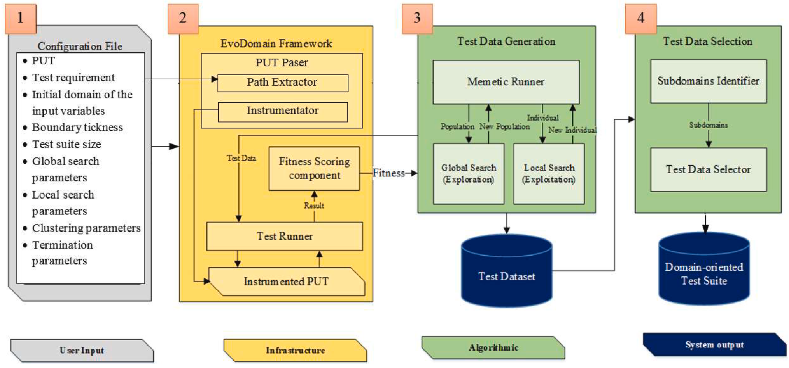
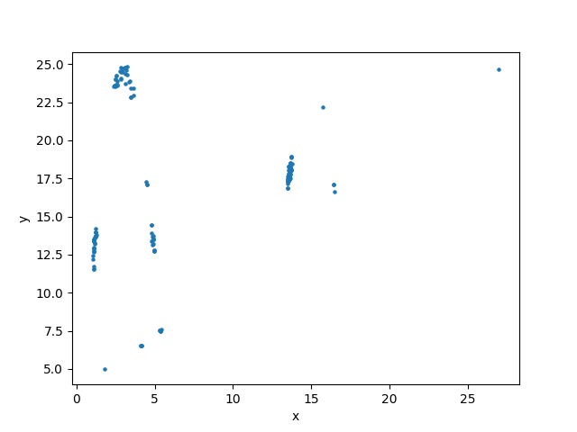
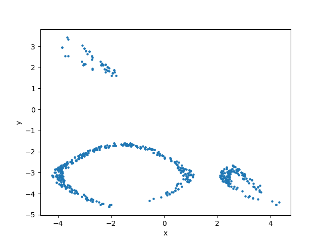
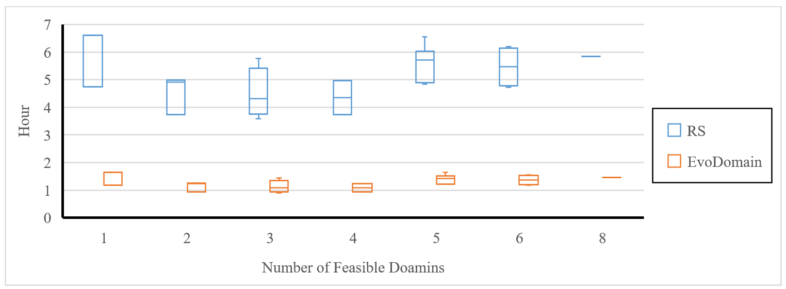
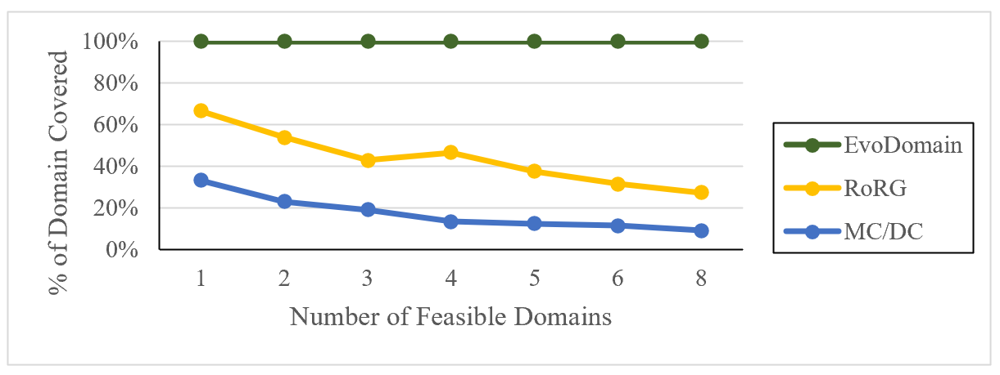
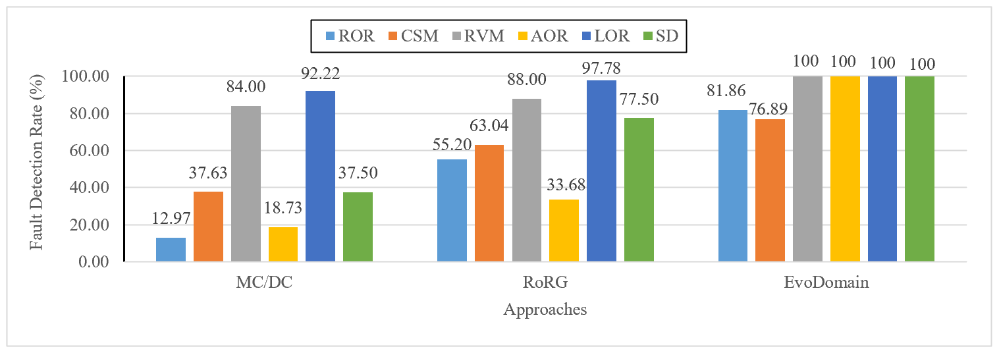

# EvoDomain

**Search-based domain-oriented test suite generation for logic-based testing**

EvoDomain is a search-based testing approach that extends conventional logic-based coverage with **domain-oriented test generation**. It targets faults that may remain undetected when test generation focuses only on logical conditions and decisions, by explicitly searching for **feasible subdomains and their boundaries**.

> **Research project:** EvoDomain was developed and evaluated as part of our research on automated test generation and domain-oriented testing.

---

## 🎯 Why EvoDomain?

Logic-based coverage criteria such as **MC/DC** are effective at exercising the logical structure of predicates, but they do not necessarily reveal faults that alter the underlying input domain.

EvoDomain addresses this limitation by searching for test data close to the boundaries of feasible subdomains and incorporating these tests into a logic-based test suite.

The key idea is simple:

**Don't only ask whether a condition has been exercised — explore where its feasible domain begins and ends.**

---

## 🔬 Approach

EvoDomain combines search-based optimization, domain analysis, and test-suite construction to identify diverse boundary test data.

The main workflow is:

1. **Analyze the subject program** and its predicates.
2. **Identify feasible subdomains** induced by predicate constraints.
3. **Search for domain boundaries** using a memetic search strategy.
4. **Improve candidate solutions locally** to refine boundary locations.
5. **Cluster candidate solutions** using DBSCAN to identify disconnected subdomains and preserve diversity.
6. **Generate boundary-oriented test data** from the discovered domains.
7. **Augment logic-based test suites** with the generated tests.
8. **Evaluate coverage and fault detection** against established approaches.

### Architecture

<p align="center">
  
</p>

---

## 🧬 Boundary-Oriented Search

At the core of EvoDomain is a **memetic search strategy**, combining evolutionary search with local improvement to efficiently locate domain boundaries.

The search is designed to discover feasible regions rather than simply generate arbitrary input values. DBSCAN is then used to identify disconnected subdomains and retain a diverse set of boundary candidates.

<p align="center">
  
</p>

<p align="center">
  
</p>

---

# 📊 Experimental Results

EvoDomain was evaluated on **30 subjects**, including **11 classic** and **19 industrial** case studies.

The evaluation examines whether EvoDomain can:

* efficiently identify feasible subdomains;
* achieve high-quality domain identification;
* improve fault detection;
* and provide benefits beyond conventional logic-based test generation.

---

## Search Effectiveness

We compared EvoDomain with **Random Search (RS)** for identifying feasible domains.

To provide a fair comparison, Random Search was given **twice the time budget** of EvoDomain and used the same DBSCAN clustering procedure for detecting disconnected subdomains.

Both approaches were able to identify the target subdomains, but EvoDomain reached effective solutions substantially faster. Random Search required up to **four times the test budget** to reach comparable solutions.

This demonstrates that domain-oriented test generation is not simply a matter of generating more random tests: **effective search guidance is critical for reaching useful domain boundaries efficiently.**

<p align="center">
  
</p>

---

## Domain Coverage

A central goal of EvoDomain is to identify the feasible regions induced by predicates and to generate tests around their boundaries.

The domain-coverage results show how effectively the selected approaches cover the target subdomains.

<p align="center">
  
</p>

---

## Fault Detection

The ultimate goal of test generation is not merely to achieve coverage, but to **expose faults**.

EvoDomain was evaluated against conventional approaches across multiple fault types, including:

* ROR — Relational Operator Replacement
* CSM — Computational Shift Mutation
* RVM — Relational Variable Mutation
* AOR — Arithmetic Operator Replacement
* LOR — Logical Operator Replacement
* SD — Statement Deletion

Across **114 subject–fault-type cases**, EvoDomain achieved the highest fault detection in **74 cases**.

More importantly, EvoDomain outperformed the compared approaches across **all evaluated fault categories**. The strongest improvement was observed for **Arithmetic Operator Replacement (AOR)** faults, which are particularly challenging for conventional logical coverage because their effects can alter the internal boundaries of predicate domains without necessarily changing the logical structure exercised by the test suite.

For example, EvoDomain increased the average fault detection associated with MC/DC from **7.78% to 68.89%**, and with RoRG from **2.22% to 66.33%**.

<p align="center">
  
</p>

---

## 🏆 Key Findings

The experimental results demonstrate that EvoDomain:

| Finding                                              |        Result |
| ---------------------------------------------------- | ------------: |
| Subjects evaluated                                   |        **30** |
| Classic subjects                                     |        **11** |
| Industrial subjects                                  |        **19** |
| Fault-detection cases with EvoDomain performing best |  **74 / 114** |
| Improvement over MC/DC in fault detection            |    **74.44%** |
| Improvement over RoRG in fault detection             |    **65.06%** |
| Maximum support for fault types over MC/DC           |    **68.89%** |
| Maximum support for fault types over RoRG            |    **66.33%** |
| Convergence effectiveness improvement over COSMOS    |       **32%** |
| Accuracy across predicate subjects                   | **0.99–1.00** |
| F1-score across predicate subjects                   | **0.99–1.00** |

These results suggest that explicitly targeting **feasible domain boundaries** can complement conventional logic-based coverage and reveal faults that may otherwise remain undetected.

---

## 🧪 Evaluation Artifacts

The repository contains experimental implementations, subject programs, domain-generation results, control-flow analysis components, and evaluation notebooks.

### Evaluation notebooks

* `Evaluation measurements.ipynb`
* `Postprocessing.ipynb`

These notebooks contain the analysis and post-processing used to examine the experimental results.

---

## 📁 Repository Structure

```text
EvoDomain/
│
├── docs/
│   └── images/
│       ├── diagram.png
│       ├── ex1.gif
│       ├── ex2.gif
│       ├── search-effectiveness.png
│       ├── domain-coverage.png
│       └── fault-detection-rate.png
│
├── experiments/
│   ├── CFG/
│   ├── Code/
│   ├── Domain/
│   └── path/
│
├── src/
│   ├── cfg/
│   ├── code_coverage/
│   ├── domain/
│   │   ├── mcmc/
│   │   └── multi_swarm/
│   ├── GA/
│   ├── instrument/
│   └── sut/
│
├── Evaluation measurements.ipynb
├── Postprocessing.ipynb
├── requirements.txt
└── README.md
```

### Main components

| Component                 | Purpose                                    |
| ------------------------- | ------------------------------------------ |
| `src/domain/`             | Domain and boundary analysis               |
| `src/GA/`                 | Evolutionary and local search              |
| `src/domain/mcmc/`        | MCMC-based domain exploration              |
| `src/domain/multi_swarm/` | Multi-swarm search components              |
| `src/cfg/`                | Control-flow graph analysis                |
| `src/code_coverage/`      | Path and coverage analysis                 |
| `src/instrument/`         | Program instrumentation                    |
| `src/sut/`                | Subject programs                           |
| `experiments/`            | Experimental data and intermediate results |

---

## ⚙️ Installation

EvoDomain was originally developed and evaluated using **Python 3.6.4**.

Clone the repository:

```bash
git clone https://github.com/IUST-EXPERT/EvoDomain.git
cd EvoDomain
```

Install the dependencies:

```bash
pip install -r requirements.txt
```

The current `requirements.txt` specifies the required package names without version pins because the exact historical dependency versions of the original Python 3.6 environment are no longer available.

---

## ▶️ Usage

The main entry point is:

```bash
python src/main.py
```

The repository also contains individual implementations for domain analysis, evolutionary search, instrumentation, control-flow analysis, and subject programs that can be explored independently.

---

## 🔭 Research Contribution

EvoDomain investigates a fundamental limitation of conventional logic-based testing:

> **Logical coverage does not necessarily imply adequate coverage of the underlying input domain.**

By explicitly searching for feasible subdomains and their boundaries, EvoDomain introduces a complementary perspective on test adequacy — one that considers **where the behavior changes in the input domain**, rather than only whether logical conditions have been exercised.

This work formed part of a broader research direction on **domain-oriented and behavioral testing of complex software and autonomous systems**.

---

## 📄 Publication

**Kalaee, A., Parsa, S., & Mansouri, Z. (2025).**
*Enhancing logic-based testing with EvoDomain: A search-based domain-oriented test suite generation approach.*
**Information and Software Technology, 177, 107564.**

DOI: `10.1016/j.infsof.2024.107564`

---

## 📜 License

See the `LICENSE` file for licensing information.
